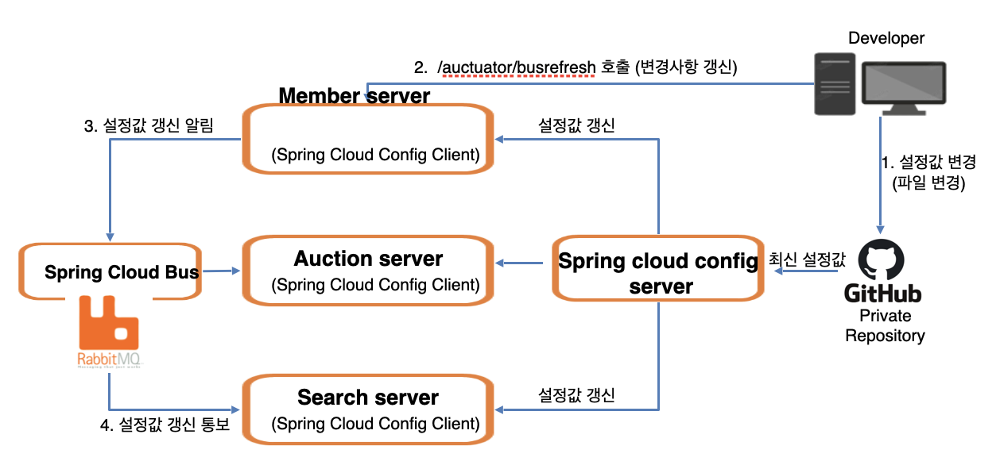

# 🌐 Spring Cloud Config

Spring Cloud Config는 분산 시스템의 구성 정보 관리를 위한 도구입니다.

---

## 🌟 주요 특징
- **분산 시스템 구성**: 서버와 클라이언트의 구성에 필요한 설정 정보(`application.yml`)를 외부 시스템에서 중앙 집중적으로 관리합니다.
- **중앙화된 저장소**: 모든 구성요소를 하나의 중앙화된 저장소에서 관리할 수 있어서 효율적입니다.
- **동적 적용**: 각 서비스를 재빌드하지 않고도 구성 변경을 적용할 수 있습니다.

---

## 🛠 Configuration value 변경 방법
### 1️⃣ 서버 재기동
각각의 마이크로 서비스를 재시작하여 새로운 구성 값을 적용합니다.

### 2️⃣ Actuator refresh
Actuator를 사용하여 새로운 구성 값을 동적으로 적용합니다.

### 3️⃣ Spring Cloud Bus 사용
Spring Cloud Bus를 사용하여 여러 서비스에 동시에 구성 변경을 알릴 수 있습니다.

---

### 🔍 Spring Cloud Bus
Spring Cloud Bus는 마이크로서비스 아키텍처에서 설정 변경을 효과적으로 전파하기 위한 메시징 시스템입니다.

### 🔍 RabbitMQ
RabbitMQ는 AMQP(Advanced Message Queuing Protocol)를 구현한 오픈 소스 메시지 브로커로, 메시지 전달의 책임을 집니다.

### 🤝 Spring Cloud Bus & RabbitMQ
- Spring Cloud Bus와 RabbitMQ의 조합은 마이크로서비스 환경에서 구성 변경 이벤트를 효과적으로 처리합니다. 
- Spring Cloud Bus는 설정 변경을 알리는 역할을 하며, RabbitMQ는 해당 메시지를 실제로 전달하는 역할을 합니다.

